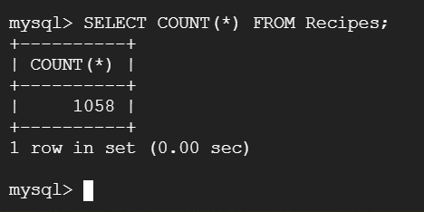

# Database Implementation and Indexing

## Data Definition Language (DDL) Commands

Below are the DDL Commands we used to make the tables in our database.

- CREATE TABLE UserInfo(
    UserID VARCHAR(255) PRIMARY KEY,
    Password VARCHAR(255),
    Name VARCHAR(255) );

- CREATE TABLE MealPlan(
    MealPlanID INT PRIMARY KEY,
    UserID VARCHAR(255),
    Name VARCHAR(255),
    Public BOOLEAN,
    FOREIGN KEY (UserID) REFERENCES UserInfo(UserID)
    ON DELETE CASCADE );

- CREATE TABLE Recipes(
    RecipeID INT PRIMARY KEY,
    Name VARCHAR(255),
    UserID VARCHAR(255) DEFAULT NULL,
    Public BOOLEAN,
    FOREIGN KEY (UserID) REFERENCES UserInfo(UserID)
    ON DELETE SET NULL );

- CREATE TABLE Foods(
    FoodName VARCHAR(255) PRIMARY KEY,
    Calories INT,
    Fat INT,
    Carbohydrates INT,
    Protein INT );

- CREATE TABLE NutritionLog(
    UserID VARCHAR(255) NOT NULL,
    Time DATETIME,
    RecipeID INT,
    PRIMARY KEY (UserID, Time),
    FOREIGN KEY (UserID) REFERENCES UserInfo(UserID)
    ON DELETE CASCADE,
    FOREIGN KEY (RecipeID) REFERENCES Recipes(RecipeID)
    ON DELETE SET NULL );
  
- CREATE TABLE MealPlanRecipes(
    MealPlanID INT,
    RecipeID INT,
    PRIMARY KEY (MealPlanID, RecipeID),
    FOREIGN KEY (MealPlanID) REFERENCES MealPlan(MealPlanID)
    ON DELETE CASCADE,
    FOREIGN KEY (RecipeID) REFERENCES Recipes(RecipeID)
    ON DELETE CASCADE );

- CREATE TABLE Ingredients(
    RecipeID INT,
    FoodName VARCHAR(255),
    PRIMARY KEY (RecipeID, FoodName),
    Quantity REAL NOT NULL,
    FOREIGN KEY (RecipeID) REFERENCES Recipes(RecipeID)
    ON DELETE CASCADE,
    FOREIGN KEY (FoodName) REFERENCES Foods(FoodName)
    ON DELETE CASCADE );

### Screenshot of Tables

Below is a screenshot of our terminal connection within GCP of our database and its tables.

## Insertion Commands

Below are screenshots of four of our tables with over 1000 entries.

## Advanced SQL Queries and Top 15 Rows
TODO - Dan and Jason - Provide Screenshots of top 15 rows for 1, 3, 4, and 5.

Below are the commands used for each advanced SQL query as well as screenshots of the first 15 rows in the output.

1. SELECT SUM(Calories) AS sumCalories, SUM(Fat) AS sumFat, SUM(Carbohydrates) AS sumCarbohydrates, SUM(Protein) AS sumProtein
FROM Foods NATURAL JOIN (SELECT FoodName 
	FROM Ingredients
	WHERE RecipeID IN (SELECT RecipeID
		FROM MealPlanRecipes
		WHERE MealPlanID = currMealPlan)) AS ingredientNames;

For the purposes of this query, when running it in SQL, we replaced currMealPlan with a hardcoded value (as seen in the screenshot). In this case, we gave it the meal plan IDs of 0 and 1, but when running it with the website, it would utilize the current user's selected meal plan id. Also, you can see that this advanced query only returns one row, not 15 rows. The reason for this is its aggregation commands. This advanced query is meant to return to a certain user the total macronutrient content for their selected meal plan. As a result, it makes sense that only one row gets returned, which is the row containing the total macro nutrient content of the meal plan with ID currMealPlan (0 or 1 in the screen shots). Returning multiple rows wouldn't make sense for this advanced query unless it is modified to return the macronutrient content of multiple meal plans at once.
  

2. SELECT COUNT(RecipeID), CurrDate
FROM (
    SELECT nl.UserID, CAST(nl.Time AS DATE) AS CurrDate, nl.RecipeID
    FROM NutritionLog nl
    JOIN Recipes r ON nl.RecipeID = r.RecipeID
    WHERE nl.UserID = currUser AND r.Public = 1
) AS userRecipes
GROUP BY CurrDate;

For the purposes of our query, we replaced currUser with 'jattoenn', one of our current users. We note that this query only outputs 2 rows because user 'jattoenn' only has two entries in their nutrition log. This query is meant to return the number of public recipes made on a given date by a user, namely in our case, 'jattoenn'.

3. SELECT SUM(Calories) AS sumCalories, SUM(Fat) AS sumFat, SUM(Carbohydrates) AS sumCarbohydrates, SUM(Protein) AS sumProtein
FROM Foods NATURAL JOIN (SELECT FoodName 
	FROM Ingredients
	WHERE RecipeID IN (SELECT RecipeID
		FROM NutritionLog
		WHERE UserID = currUser AND (CAST(Time AS DATE) = CURRENT_DATE()))) AS userDailyRecipes;

For the purposes of this advanced query, currUser was replaced with a hardcoded value, the user ID 'aabrahmovicio6' in this case. The reason for this is that it needs to be an actual user id to run, and when this query runs on the website, it would receive the current user's ID as input. This advanced query is meant to take the current date as input and the current user's ID and find the total macronutrient count of everything that user ate that day. So, due to the aggregation, only one row is returned by the advanced query (instead of 15), which makes sense as it aggregates all the macronutrient information together. If multiple rows were to be returned, this advanced query would need to be changed to give the macronutrient content of every recipe eaten on the current date (without aggregation).

  

4. SELECT COUNT(MealPlanID) as MealPlanCount, CurrDate
FROM (SELECT UserID, MealPlanID, CAST(Time as DATE) AS CurrDate
	FROM MealPlan NATURAL JOIN NutritionLog
	WHERE UserID = currUser and Public = 1) AS userMealPlans
GROUP BY CurrDate; 

For the purposes of our query, we replaced currUser with 'aabrahmovicio6', one of our current users. We note that this query only outputs 2 rows because user 'aabrahmovicio6' only has two meal plans created on 07/03/2024 and one meal plan created on 03/30/2025 in their nutrition log. This query is meant to return the number of public meal plans made on a given date by a user, namely in our case, 'aabrahmovicio6'.

5. SELECT AVG(Calories) AS avgCalories, AVG(Fat) AS avgFat, AVG(Carbohydrates) AS avgCarbohydrates, AVG(Protein) AS avgProtein
FROM Foods NATURAL JOIN (SELECT FoodName 
	FROM Ingredients
	WHERE RecipeID IN (SELECT RecipeID
		FROM NutritionLog
		WHERE UserID = currUser AND (CAST(Time AS DATE) = CURRENT_DATE()))) AS userDailyAvg;

For the purposes of our query, we replaced currUser with 'jattoenn', one of our current users. This query returns null values for all columns because user 'jattoenn' has no entries on the current day (03/29/2025) in their nutrition log. This query is meant to return the average calories, carbohydrates, fats, and proteins an individual user has eaten in a given day, based on their recipe intake, adjusted by the quantities listed in the Ingredients table that go into the recipes.

6. SELECT FoodName, COUNT(FoodName) as timesIngredientUsed, Quantity
FROM NutritionLog NATURAL JOIN Ingredients NATURAL JOIN Foods
WHERE UserID = currUser AND Protein >= 20
GROUP BY FoodName, Quantity
HAVING Quantity >= 100
ORDER BY timesIngredientUsed DESC;

For the purposes of our query, we replaced currUser with 'aabrahmovicio6', one of our current users. This query returns the most common high-protein, high-quantity ingredients that user 'aabrahmovicio6' uses in their meal plan recipes. This query returns the food name, the amount of times this ingredient was used, and the quantity that was used for this ingredient.

## Final Index Design
TODO - Everyone

Below we have grouped each SQL query and shown the output of each EXPLAIN ANALYZE command with the different indices, making final remarks for each query. We do not repeat the queries because we use the same numbering as above.

### 1. 

- Original Cost: 19.4
  

- Multiple Index on Foods(Calories, Fat, Carbohydrates, Protein): 15.4
  

- Single Index on Foods(Calories): 15.4
  

- Single Index on Foods(Fat): 15.4
  

- Single Index on Foods(Carbohydrates): 15.4
  

### 2. 

- Original Cost: 2.3

  

- Single Index on NutritionLog.RecipeID: 2.3

  
 

- Indices on both Recipes.Public and NutritionLog.RecipeID: 1.4

  

- Single Index on Recipes.Public: 1.4

  

- Best Index Design by Cost: Both the single index on Recipes.Public and the two indices on both Recipes.Public and NutritionLog.RecipeID have the same cost. However, one could choose the simpler index design of only Recipes.Public for simplicity/parsimony in case of future queries. However, time-wise, having both indices is slightly faster. Either choice could be made, depending on the other queries. 

### 3. 

- Original Cost: 29.5
  

- Multiple Index on Foods(Calories, Fat, Carbohydrates, Protein): 23.5
  

- Single Index on Foods(Calories): 23.5
  

- Single Index on Foods(Fat): 22.9
  

- Single Index on Foods(Carbohydrates): 22.9
  

- Single Index on NutritionLog(RecipeID): 22.9
  

### 4. 

- Original Cost: 1.73
  
  

- Single Index on MealPlan.Public: 1.73
  
  

- Index on both MealPlan.Public and MealPlan.UserID: 1.73
  
  

- Single Index on MealPlan.UserID: 1.73
  
  

- Best Index Design by Cost: We note that the best index design would be any of the indices or none of them since the cost does not change when adding indices. They all did not work likely because the attributes that we are joining on are primary keys, so indices are not necessary for this query.

### 5. 

- Original Cost: 12

  

- Single Index on Foods.Calories: 12

  

- Index on All Foods Attributes: 12

  

- Index on Ingredients.Quantity: 10.5

  

- Best Index Design by Cost: We note that the best index design was the one only with Ingredients.Quantity. The others likely did not work well because their values did not depend on any others, while Ingredients.Quantity does depend on the Food(s) involved due to the foreign key relationship. Further testing may be required on this, but because of the other testing on Foods indices, it is likely that this index design is best for this type of query.

### 6. 
- Original Cost: 12.7
  
  

- Single Index on Ingredients.Quantity: 12.7
  
  

- Indices on both Ingredients.Quantity and Foods.Protein: 12.7
  
  

- Single Index on Foods.Protein: 12.7
  
  
  
- Best Index Design by Cost: We note that the best index design would be any of the indices or none of them since the cost does not change when adding indices. They all did not work likely because the attributes that we are joining on are primary keys, so indices are not necessary for this query.

### Final Analysis
TODO
