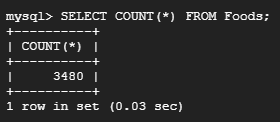
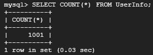

# Database Implementation and Indexing

## Data Definition Language (DDL) Commands

Below are the DDL Commands we used to make the tables in our database.

- CREATE TABLE UserInfo(
    UserID VARCHAR(255) PRIMARY KEY,
    Password VARCHAR(255),
    Name VARCHAR(255) );

- CREATE TABLE MealPlan(
    MealPlanID INT PRIMARY KEY,
    UserID VARCHAR(255),
    Name VARCHAR(255),
    Public BOOLEAN,
    FOREIGN KEY (UserID) REFERENCES UserInfo(UserID)
    ON DELETE CASCADE );

- CREATE TABLE Recipes(
    RecipeID INT PRIMARY KEY,
    Name VARCHAR(255),
    UserID VARCHAR(255) DEFAULT NULL,
    Public BOOLEAN,
    FOREIGN KEY (UserID) REFERENCES UserInfo(UserID)
    ON DELETE SET NULL );

- CREATE TABLE Foods(
    FoodName VARCHAR(255) PRIMARY KEY,
    Calories INT,
    Fat INT,
    Carbohydrates INT,
    Protein INT );

- CREATE TABLE NutritionLog(
    UserID VARCHAR(255) NOT NULL,
    Time DATETIME,
    RecipeID INT,
    PRIMARY KEY (UserID, Time),
    FOREIGN KEY (UserID) REFERENCES UserInfo(UserID)
    ON DELETE CASCADE,
    FOREIGN KEY (RecipeID) REFERENCES Recipes(RecipeID)
    ON DELETE SET NULL );
  
- CREATE TABLE MealPlanRecipes(
    MealPlanID INT,
    RecipeID INT,
    PRIMARY KEY (MealPlanID, RecipeID),
    FOREIGN KEY (MealPlanID) REFERENCES MealPlan(MealPlanID)
    ON DELETE CASCADE,
    FOREIGN KEY (RecipeID) REFERENCES Recipes(RecipeID)
    ON DELETE CASCADE );

- CREATE TABLE Ingredients(
    RecipeID INT,
    FoodName VARCHAR(255),
    PRIMARY KEY (RecipeID, FoodName),
    FOREIGN KEY (RecipeID) REFERENCES Recipes(RecipeID)
    ON DELETE CASCADE,
    FOREIGN KEY (FoodName) REFERENCES Foods(FoodName)
    ON DELETE CASCADE );

### Screenshot of Tables

Below is a screenshot of our terminal connection within GCP of our database and its tables.

## Insertion Commands
TODO - Chi - No Need to Write this here! Write in Google doc until we have Stage 2 graded.

Below are screenshots of the three databases with over 1000 entries.

## Advanced SQL Queries
TODO - Dan and Jason (2 each) - Give small description of each query for faster grading; make sure it's accurate though.
### Top 15 Rows of Each Query
TODO - Dan and Jason (2 each; just output the query)
## Final Index Design
TODO - Everyone (1 each)
