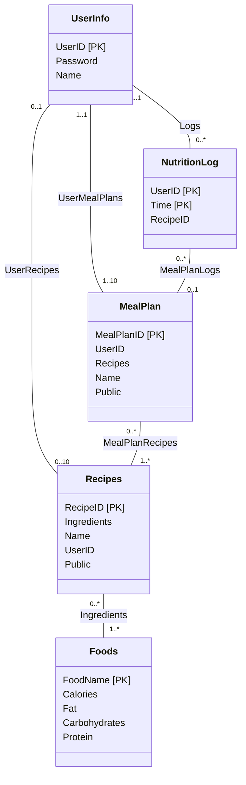

# Conceptual and Logical Database Design

## UML Diagram

We have marked the primary keys with `[PK]` for clarity in our UML diagram below.

## Assumptions and Description of Entities and Relationships

# Entities

We have a grand total of five entities in our database, with their assumptions and descriptions laid out below.

- **UserInfo**:

We plan to create a UserInfo entity, which we assume will contain a user’s login information. Therefore, this entity will be made up of the following three attributes: UserID, Password, and Name. Each user will create his or her account by specifying a unique username/email in the form of a VARCHAR that will be used as the primary key for the UserInfo table. The user should also enter their password, a VARCHAR, that will be used to log in. The user can enter their name, which is again a VARCHAR, which will be displayed in the user interface.

UserInfo is an entity on its own because each user is an entity in and of themselves; making UserInfo into an attribute would make it very hard to separate users as entities within the database, and hurt our functionality of user customization through recipes and meal plans. Additionally, UserInfo is a many in a many-to-one relationship () and it has multiple non-key attributes, which also helps justify it as an entity.
  
- **Foods**:
  
We assume the Foods entity to contain five attributes, which are the food name, calories, fat, carbohydrates, and protein. These attributes are sourced directly from the existing datasets we use that contain the macronutrient information of various foods. FoodName is of the VARCHAR type, and Calories, Fat, Carbohydrates, and Protein are of the INT type (these are often measured in integer grams, so this makes sense). The datasets contains over 2000 entries of different kinds of foods. Each kind of food will have a unique name, which will be used as the primary key. For each kind of food, the datasets contain the common nutritional facts (calories, fat, carbohydrates, protein) per unit quantity (100 grams for example) about it. The Foods entity will not be editable by any user; it will only be edited by an admin if necessary (e.g., adding a new food).

Foods is an entity on its own because each food is a thing, with characteristics such as calories and fat content. In this way, it’s clear that foods have at least three attributes other than their names. Additionally, Foods is a many in a many-to-many relationship, further justifying its status as an entity.
  
- **Recipes**:

We will have a separate Recipes entity that will be a table of recipes created either by a user or sourced from our datasets. Recipes will contain five attributes in their corresponding table, which are the RecipeID, a list of ingredients (Ingredients), the recipe name (Name), which user created the recipe (NULL if it wasn’t user created), and a public variable that determines if a recipe is viewable by all users or just the one that created it. We assume that the Recipes entity will gain more recipes as users create them, and that the ingredients entered into the recipes only come from our database of foods. The reason for this constraint is that our application wants to give the macros of a recipe as well, and we would only have the macronutrient information of a food/ingredient that’s in our database. To enforce this, we would likely create a drop-down menu for selecting ingredients when they create a recipe, which would only allow them to select from foods/ingredients in our food database. 

One reason we modeled recipes as a separate entity is because a recipe is a thing. Also, the Recipes entity has multiple (necessary) non-key attributes and is the “many” in two many-to-many relationships, which satisfies principle 3. Another reason Recipes needs to be a separate entity is because a recipe, at least the way we designed it, would not fit as an attribute of another entity. Our recipes need names/IDs to distinguish them, a list of ingredients, and a way to determine if a recipe is user-created or not.

- **NutritionLog**:

We plan to have a NutritionLog entity that will be a table that keeps track of each user’s total macronutrient consumption for each day. Since the macronutrient information will be aggregated from our Foods entity by using the list of ingredients in a recipe, this entity only needs to store a list of the recipes the user ate for that day (with each entry being one recipe). There will also be an attribute for attributing a user to each entry, and another attribute to hold the timestamp of that entry in the nutrition log (in DATETIME, for uniqueness). Entries into the nutrition log will be created by the user manually entering what recipes they had that day into some form using a list of recipes available to them, or the recipe information is automatically taken from the user’s selected meal plan. Then, the user’s UserID and a timestamp (date and time) of when they entered the entry will also be automatically recorded.

One reason we treat the nutrition log as a separate entity from the UserInfo entity rather than an attribute is because treating it as an attribute of UserInfo would cause a lot of redundancy. That is, a User’s info would likely need to be repeated multiple times unnecessarily to properly create a nutrition log for them within the UserInfo entity. The implementation would thus be rather clunky if we were to do this. Another reason the nutrition log is a separate entity is because it’s the many in a many-to-one relationship and has multiple non-key attributes (which are the user id and list of recipes). These satisfy principle 3 for determining if something is an entity.
  
- **MealPlan**:
  
We assume the MealPlan entity to contain five attributes: MealPlanID, UserID, Recipes, Name, and Public. Users are able to combine recipes into a bigger entity known as a Meal Plan. This information is stored in the MealPlan table and each meal plan has its own unique ID named MealPlanID (INT type) as the primary key for lookup. The table also saves the corresponding UserID (as VARCHAR(255)) of who created the meal plan (which is also a foreign key to the UserInfo table). This UserID will be checked whenever the corresponding meal plan is queried, and the meal plan is always accessible to its UserID, which is the user who created the meal plan. The main body of the MealPlan table is the Recipes as VARCHAR(255), which contains all the recipes of the meals the user entered and has enough storage space for a week’s recipes. Notice that it is not a foreign key to the recipes table because we want to store multiple (10 at maximum) recipes in a single meal plan entry. The user can give the meal plan a name to better distinguish different plans; for example, possible names can be “Low Fat”, “High Protein”, or “Low Carbs.” Finally, the user can show his or her meal plan to other users by setting the Public variable, which is a boolean type, to True. This is helpful when new users want to learn how to control their nutrition intake from more experienced users or just share this information with friends or family.

MealPlan is an entity on its own because meal plans are objects (a thing) created by users that contain aggregated information from the recipes. It has its own attribute Recipes and Name in VARCHAR(255) and Public in Boolean, which are all separate, important attributes aside from the primary key. 

# Relationships

We have a grand total of six relationships in our database, four of which are one-to-many/many-to-one and two of which are many-to-many. Their assumptions and descriptions are laid out below.

- **UserInfo - Recipes (One-to-Many)**: UserInfo has a relationship with the Recipes entity, which has a cardinality of one-to-many. Each user will be able to create many (up to 10) recipes, but each recipe can only belong to one user. This means each user is linked to many recipes since we do not restrict them to only creating one recipe. We do this because restricting them to one recipe wouldn’t make much sense as people can make potentially infinitely many recipes and we chose 10 recipes as a limit so the data doesn’t get out of hand. 
  
- **Recipes - Foods (Many-to-Many)**: The Recipes entity will have a relationship with our Foods database entity (called Ingredients in our diagram), and the cardinality of this relationship is many-to-many. This is because each food can belong to many recipes, and each recipe can have many different foods (ingredients). We chose this relationship because that’s how it works in real life (and is logical), since it would make no sense for a recipe to have only one food/ingredient or a food to belong only to one recipe. After all, that would severely limit the number of possible recipes. 

- **Recipes - MealPlan (Many-to-Many)**: Our Recipes entity will have a relationship with our MealPlan entity (called MealPlanRecipes). The cardinality of this relationship is many-to-many. This is because we plan to allow a meal plan to consist of many recipes (a user can store up to 10), and each recipe can belong to any number of meal plans. The reason for this is because a meal plan should consist of at least one recipe, otherwise there’s no meal plan. And we put no limit on the number of recipes in a meal plan because that is a decision that should be made by the user. It also makes no logical sense to limit each recipe to a single meal plan since recipes aren’t a resource with limited stock. For more clarity, a single meal plan can include multiple recipes, allowing users to record different recipes for each meal of the day, such as breakfast, lunch, and dinner. At the same time, a single recipe can be included in multiple meal plans. For example, chicken breast can be included both in “High Protein” and “Low Carbs” meal plans. This correspondence is recorded in the MealPlanRecipes table.

- **NutritionLog - UserInfo (Many-to-One)**: Our Nutrition Log entity will have a relationship with the UserInfo entity (called Logs). The cardinality of this relationship is many-to-one. We assume that zero or more entries in the nutrition log will be connected to one user in the UserInfo entity. This is because Nutrition Log stores every entry from a user on a separate row since the timestamps for each entry are unique. So, it must be in a many relationship rather than having only one entry for each user. Also, it makes more sense to have many entries for each user since it needs to log the nutrition of a user over time, rather than just once. The reason we don’t let one entry belong to many users is because each entry into the nutrition log is meant to be for only one user, not multiple users.

- **NutritionLog - MealPlan (Many-to-One)**: Our Nutrition Log entity will have a relationship with the Meal Plan entity. The cardinality of this relationship is many-to-one. Each entry in the nutrition log can correspond to zero or one meal plan recorded in the Meal Plan entity since each meal plan is designed to contain the recipes a user will eat in a day. Also, each user can only select one meal plan for each day, so it wouldn’t make sense for a nutrition log entry, which is an entry for just one day, to correspond to more than one meal plan.

- **MealPlan - UserInfo (Many-to-One)**: Our MealPlan entity will have a relationship with UserInfo. The cardinality of this relationship is many-to-one. All entries in MealPlan should be entered by one and only one user, which is the UserID stored in the table. At the same time, each user can have multiple meal plans. This is because attributing a meal plan to many users would be confusing and clunky to implement. On top of this, we give users the ability to set their meal plans to public, so other users can copy them if they wish, removing the need to make the relationship many-to-many in the first place. It also doesn’t make sense to attribute a meal plan to less than one user, as unlike the Recipes table, we won’t be providing the meal plans; users enter them instead and they get added to our MealPlan table as users create them.

## Normalization - 3NF

We will show our schema adheres to 3NF without any additional normalization. 

First, for UserInfo, the only functional dependencies (FDs) are UserID to Password and UserID to Name, when separating the FDs that have singletons on the right-hand side (RHS). This is because UserID is the intended key of this entity. Thus, since UserID determines all the other attributes, it is a superkey for UserInfo. Therefore, UserInfo is in 3NF.

Second, for Foods, the only functional dependencies are FoodName to Calories, FoodName to Carbohydrates, FoodName to Fat, and FoodName to Protein. We have not included a FD from (Carbohydrates, Fat, Protein) to Calories because two different foods could have the same macronutrients but different Calories, as Calories is not solely dependent on macronutrients (vitamins and minerals are also factors). We know FoodName has all these FDs because FoodName is the intended key of the Foods entity. Thus, since FoodName determines all the other attributes, it is a superkey for Foods. Therefore, Foods is in 3NF.
Third, for Recipes, the only FDs are RecipeID to Ingredients, RecipeID to Name, RecipeID to UserID, and RecipeID to Public. This is because RecipeID is the intended key of the Recipes entity, and thus given a RecipeID, we can uniquely identify the other attributes in said observation. We considered other FDs such as Ingredients to Name and Name to Ingredients, but these would not hold. For Ingredients to Name, imagine we have two different kinds of bread, each with the same recipe. They are different in Name because they are cooked in different ways and thus taste, smell, and even feel different. Therefore, this FD cannot hold. For Name to Ingredients, a similar situation occurs. Say we have two different observations for Tomato Soup, but one has garlic in the recipe and another does not. This is a very real occurrence in cooking and therefore violates this FD. Therefore, there are no other FDs other than those with RecipeID on the left-hand side (LHS). Since we can determine every other attribute given a RecipeID, RecipeID is thus a superkey and the assumptions for 3NF are fulfilled for the Recipes table.

Fourth, for NutritionLog, the only FD we have is (UserID, Time) to RecipeID. This is because (UserID, Time) is the intended key of the NutritionLog entity, and Time is registered as a DATETIME variable (therefore, completely unique). There are no other sensible FDs, as neither of UserID or Time alone can determine any of the other attributes; this holds similarly for RecipeID alone or for any other combination of the attributes. Thus, since (UserID, Time) determines every other attribute, (UserID, Time) is a superkey and thus NutritionLog is in 3NF.

Lastly, for MealPlan, the only FDs are MealPlanID to UserID, MealPlanID to Recipes, MealPlanID to Name, and MealPlanID to Public. These FDs come from the fact that MealPlanID is the intended key for the MealPlan entity. For any other possible FD, it is impossible to verify them as reasonable FDs as if we have two different values for the LHS of some FD, then they could very reasonably have the same value on the RHS of this FD. A good example of this is Recipes to Name; one set of recipes could contain tomato soup and bread, while another could contain alfredo pasta and garlic bread, but the Name for both meal plans could be Bob (if a user were to name their meal plans strangely, that is). Thus, it is clear that no other FDs exist in this entity besides the ones from the key. Therefore, since a MealPlanID uniquely identifies each other attribute in the entity, MealPlanID is a superkey, finally giving that MealPlanID is in 3NF.

Our relationship-entities in the logical schema (such as MealPlanRecipes below) only contain the keys to link up their respective tables. Therefore, no normalization is necessary.

Therefore, by our initial construction of our database, each entity is in 3NF, which means the database is in 3NF as well. 

## Logical Design / Relational Schema

We separate our logical design below where each bullet point holds information about one table.

- UserInfo(UserID: VARCHAR(255) [PK],
Password: VARCHAR(255),
Name: VARCHAR(255))
  
- NutritionLog(UserID: VARCHAR(255) [PK],
		Time: DATETIME [PK],
		RecipeID: INT [FK to Recipes.RecipeID])
  
- MealPlan(MealPlanID: INT [PK],
		UserID: VARCHAR(255) [FK to UserInfo.UserID],
		Recipes: VARCHAR(255),
		Name: VARCHAR(255),
		Public: Boolean)

- MealPlanRecipes(MealPlanID: INT [FK to MealPlan.MealPlanID] [PK],
			RecipeID: INT [FK to Recipes.RecipeID] [PK])

- Recipes(RecipeID: INT [PK],
		Ingredients: VARCHAR(255),
		Name: VARCHAR(255),
		UserID: (DEFAULT NULL) VARCHAR (255) [FK to UserInfo.UserID],
		Public: Boolean)

- Ingredients(RecipeID: INT [FK to Recipes.RecipeID] [PK],
			FoodName: VARCHAR(255) [FK to Foods.FoodName] [PK])

- Foods(FoodName: VARCHAR(255) [PK],
			Calories: INT,
			Fat: INT,
			Carbohydrates: INT,
			Protein INT)

