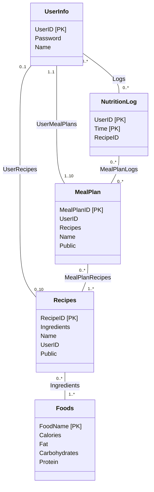

```mermaid
classDiagram
  class UserInfo {
      UserID [PK]
      Password
      Name
  }
  class Foods {
      FoodName [PK]
      Calories
      Fat
      Carbohydrates
      Protein
  }
  class Recipes {
      RecipeID [PK]
      Ingredients
      Name
      UserID
      Public
  }
  class NutritionLog {
      UserID [PK]
      Time [PK]
      RecipeID
  }
  class MealPlan {
      MealPlanID [PK]
      UserID
      Recipes
      Name
      Public
  }
UserInfo "1..1" -- "1..10" MealPlan : UserMealPlans
UserInfo "0..*" -- "0..*" NutritionLog : Logs
UserInfo "0..1" -- "0..10" Recipes : UserRecipes
NutritionLog "0..*" -- "0..*" MealPlan : MealPlanLogs
MealPlan "0..*" -- "1..*" Recipes : MealPlanRecipes
Recipes "0..*" -- "1..*" Foods : Ingredients
```
