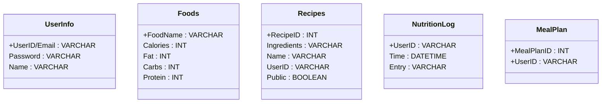

```mermaid
classDiagram
  class UserInfo {
      +UserID/Email : VARCHAR
      Password : VARCHAR
      Name : VARCHAR
  }
  class Foods {
      +FoodName : VARCHAR
      Calories : INT
      Fat : INT
      Carbs : INT
      Protein : INT
  }
  class Recipes {
      +RecipeID : INT
      Ingredients : VARCHAR
      Name : VARCHAR
      UserID : VARCHAR
      Public : BOOLEAN
  }
  class NutritionLog {
      +UserID : VARCHAR
      Time : DATETIME
      Entry : VARCHAR
  }
  class MealPlan {
      +MealPlanID : INT
      +UserID : VARCHAR
  }
```
